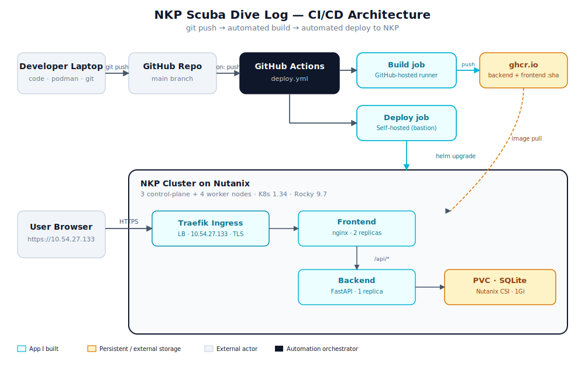

# NKP Scuba Dive Log

A small, full-stack scuba diving log application deployed end-to-end on **Nutanix Kubernetes Platform (NKP)** with a GitHub Actions CI/CD pipeline.



## What it demonstrates

This repo is intentionally small but exercises the full set of patterns customers ask about when adopting NKP:

- **Containerised application** — Python (FastAPI) backend, vanilla HTML+JS+Tailwind frontend, nginx reverse proxy. Built for `linux/amd64` so it runs on standard NKP nodes.
- **Helm-based packaging** — every Kubernetes object lives in a templated chart under `deploy/charts/scuba-divelog/` with sensible defaults in `values.yaml` and a NOTES.txt that prints next steps after install.
- **Stateful workload on Nutanix CSI** — SQLite database persisted on a `PersistentVolumeClaim` backed by the `nutanix-volume` storage class. Pod security context (`fsGroup: 1000`) handles the non-root-user + mounted-volume permission gotcha.
- **Edge ingress via Traefik / Kommander** — single LoadBalancer IP, path-based routing, TLS-by-default behaviour matching a real NKP install.
- **Hybrid CI/CD** — public GitHub-hosted runner builds and pushes images to GHCR; a self-hosted runner on the cluster bastion performs `helm upgrade --install` against the NKP API. The pattern every regulated or internal-cluster customer uses.
- **Tagged-by-SHA images** — every deploy is traceable to a single git commit (`ghcr.io/<owner>/scuba-divelog-{backend,frontend}:<sha>`).

## Repo layout

```
nkp-scuba-divelog/
├── backend/                FastAPI app + Dockerfile
│   ├── app/                models, database, routes
│   ├── requirements.txt
│   └── Dockerfile
├── frontend/               Single-page HTML+JS + nginx Dockerfile
│   ├── index.html
│   ├── nginx.conf
│   └── Dockerfile
├── deploy/charts/scuba-divelog/   Helm chart
│   ├── Chart.yaml
│   ├── values.yaml
│   └── templates/          7 K8s resources + helpers + NOTES.txt
├── compose.yml             podman compose for local dev
├── docs/                   architecture diagram, lab inventory, design sketch
└── .github/workflows/      CI/CD (build + deploy)
```

## Run locally with Podman Compose

```bash
podman machine start
podman compose up --build
# open http://localhost:8080
```

## Deploy to NKP

Prerequisites: an NKP cluster with `kubectl` and `helm` configured locally, `nutanix-volume` storage class, `kommander-traefik` ingress class.

```bash
helm install scuba deploy/charts/scuba-divelog \
  --namespace scuba \
  --create-namespace
```

Then visit the Traefik LoadBalancer IP from `kubectl get svc -n kommander kommander-traefik`.

## CI/CD

On every push to `main`, GitHub Actions (`.github/workflows/deploy.yml`):

1. **Build job** (GitHub-hosted runner): builds backend + frontend images for `linux/amd64`, pushes both to `ghcr.io/<owner>/scuba-divelog-{backend,frontend}` tagged with the short commit SHA and `latest`.
2. **Deploy job** (self-hosted runner on the cluster's bastion): runs `helm upgrade --install` with `--set backend.image.tag=<sha>` and `--set frontend.image.tag=<sha>`, then waits for pods to be healthy.

A successful push is live on the cluster in ~3–4 minutes.

## Known limitations (deferred to Phase 2)

- **TLS** — Traefik serves a self-signed default certificate; browsers warn on first load. Next iteration adds `cert-manager` + a `ClusterIssuer` so every ingress gets a valid cert automatically.
- **Private images** — packages are public for sprint simplicity. Production would use a Kubernetes `imagePullSecret` and a private GHCR or an internal Harbor registry.
- **Single-replica backend** — SQLite is a single-writer database. Migrating to PostgreSQL (with Alembic migrations and a real-HA deployment) is a planned Phase 2 deepening.
- **Self-hosted runner persistence** — runs under `nohup` because Rocky Linux SELinux blocks the systemd install path from a user home directory. Production fix is `semanage fcontext` on the runner dir.
