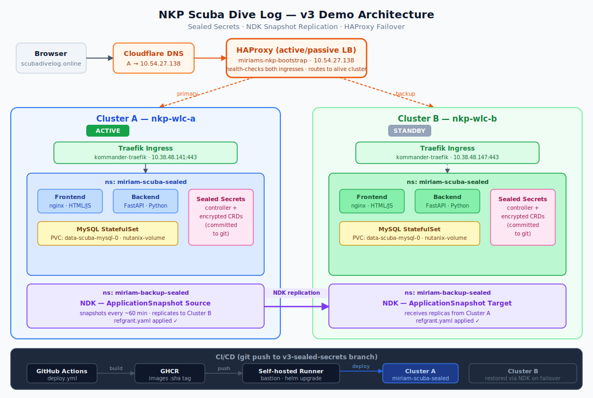
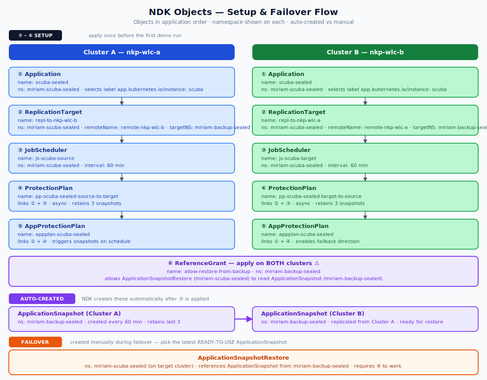

# NKP Scuba Dive Log

A full-stack scuba diving log application deployed end-to-end on **Nutanix Kubernetes Platform (NKP)** with a GitOps CI/CD pipeline and cross-cluster data protection powered by **Nutanix Data Services for Kubernetes (NDK)**.



## What it demonstrates

This repo is intentionally small but exercises the full set of patterns customers ask about when adopting NKP:

- **Containerised application** — Python (FastAPI) backend, MySQL database, vanilla HTML+JS+Tailwind frontend, nginx reverse proxy. Built for `linux/amd64` so it runs on standard NKP nodes.
- **Helm-based packaging** — every Kubernetes object lives in a templated chart under `deploy/charts/scuba-divelog/` with sensible defaults in `values.yaml` and a NOTES.txt that prints next steps after install.
- **Stateful workload on Nutanix CSI** — MySQL database persisted on a `PersistentVolumeClaim` backed by the `nutanix-volume` storage class. Pod security context (`fsGroup: 1000`) handles the non-root-user + mounted-volume permission gotcha.
- **Secrets management with Sealed Secrets** — database credentials and the Cloudflare API token are encrypted with Bitnami Sealed Secrets and committed safely to Git. The blobs are useless without the cluster's private key.
- **Edge ingress with TLS** — Traefik ingress with automatic TLS via cert-manager and Cloudflare DNS-01 challenge. A single HAProxy VM provides active/standby load balancing across two NKP clusters.
- **GitOps CI/CD with Flux** — GitHub Actions builds and pushes images tagged `main-<unix-timestamp>-<sha>`; Flux running inside the cluster detects the new tag, writes it back to Git, and reconciles the HelmRelease automatically. No inbound access to the cluster required.
- **Cross-cluster data protection with NDK** — Nutanix Data Services for Kubernetes takes hourly application-consistent snapshots and replicates them to a second NKP cluster. Failover and failback are fully scripted in the runbook under `ndk-sealed/`.

## Repo layout

```
nkp-scuba-divelog/
├── backend/                          FastAPI app + Dockerfile
│   ├── app/                          models, database, routes
│   ├── requirements.txt
│   └── Dockerfile
├── frontend/                         Single-page HTML+JS + nginx Dockerfile
│   ├── index.html
│   ├── nginx.conf
│   └── Dockerfile
├── deploy/charts/scuba-divelog/      Helm chart
│   ├── Chart.yaml
│   ├── values.yaml
│   └── templates/                    Deployments, Services, Ingress, PVC,
│                                     MySQL StatefulSet, SealedSecret templates
├── clusters/demo/                    Flux GitOps manifests
│   ├── namespace.yaml                target namespace declaration
│   ├── scuba-helmrelease.yaml        HelmRelease (image tags auto-updated by Flux)
│   └── image-automation.yaml         ImageRepository + ImagePolicy + ImageUpdateAutomation
├── ndk/                              Nutanix Data Services manifests — plain YAML
├── ndk-sealed/                       NDK manifests + sealed Cloudflare token + failover runbook
├── sealed-secrets/                   Cluster-bound SealedSecret blobs (safe to commit)
├── scripts/                          Helper scripts: re-seal secrets, seed demo data
├── compose.yml                       Podman Compose for local dev
├── docs/                             Architecture diagrams, GitOps setup guide, full runbook
└── .github/workflows/deploy.yml      CI: build + push only (Flux handles the deploy)
```

## Run locally with Podman Compose

```bash
podman machine start
podman compose up --build
# open http://localhost:8080
```

## Deploy to NKP

### Option A — One-shot Helm install

Prerequisites: `kubectl` and `helm` configured against an NKP cluster with the Sealed Secrets controller installed, `nutanix-volume` storage class, Traefik ingress class.

```bash
# Re-seal secrets for your cluster + namespace first:
./scripts/reseal-secrets.sh

helm install scuba deploy/charts/scuba-divelog \
  --namespace scuba \
  --create-namespace
```

### Option B — GitOps with Flux (recommended)

See [docs/gitops-setup.md](./docs/gitops-setup.md) for the complete step-by-step guide.

In short:
1. Install the Sealed Secrets controller and run `./scripts/reseal-secrets.sh` to generate encrypted secrets for your cluster.
2. Bootstrap Flux with image automation:
   ```bash
   flux bootstrap github \
     --owner=<your-github-org> \
     --repository=nkp-scuba-divelog \
     --branch=main \
     --path=clusters/demo \
     --components-extra=image-reflector-controller,image-automation-controller \
     --read-write-key
   ```
3. Flux reconciles the HelmRelease and keeps it in sync with every new image push — no runner on the cluster, no push-based deploy.

## CI/CD

On every push to `main` that touches `backend/` or `frontend/`, GitHub Actions (`.github/workflows/deploy.yml`):

1. **Build job** (GitHub-hosted runner): builds backend + frontend images for `linux/amd64`, pushes both to `ghcr.io/miriamcsn/scuba-divelog-{backend,frontend}` tagged `main-<unix-timestamp>-<sha>` and `:latest`.
2. Flux's **image-reflector controller** scans GHCR every 5 minutes, detects the new tag, and selects the newest one via the `ImagePolicy` (ordered by the embedded timestamp — no `latest` tag ambiguity).
3. Flux's **image-automation controller** commits the updated tag back into `clusters/demo/scuba-helmrelease.yaml` and pushes to `main`. Pushes that only touch `clusters/**` are ignored by CI to avoid a build loop.
4. Flux's **helm controller** detects the Git change and rolls out the new image on the cluster.

A successful push is live in roughly 5–10 minutes end-to-end (build + Flux scan interval).

## Data Protection with NDK

The `ndk/` and `ndk-sealed/` directories contain **Nutanix Data Services for Kubernetes** manifests that demonstrate application-consistent data protection across two NKP clusters:

| Object | Purpose |
|--------|---------|
| `Application` | Declares which workload NDK tracks (label-based selector) |
| `JobScheduler` | Triggers snapshots every 60 minutes |
| `ProtectionPlan` | Defines retention (3 snapshots) and links to replication |
| `ReplicationTarget` | Points to the standby cluster |
| `AppProtectionPlan` | Ties the Application to its ProtectionPlan |



**Failover** (cluster A goes down): restore the latest replicated snapshot on cluster B, then `helm upgrade --install` to take Helm ownership of the restored resources. HAProxy detects cluster B is healthy via `/healthz` and routes traffic automatically.

**Failback** (cluster A recovers): same process in reverse — restore on A, clean up B.

See [docs/runbook-ndk-demo-sealed-secrets.md](./docs/runbook-ndk-demo-sealed-secrets.md) for step-by-step failover and failback procedures.

## Secrets management

All secrets are stored as **Bitnami Sealed Secrets** — asymmetrically encrypted with the cluster's public key. The encrypted blobs in this repo cannot be decrypted without access to the sealed-secrets controller private key on the target cluster.

To deploy on a new cluster, re-seal the secrets:
```bash
export KUBECONFIG=~/.kube/<new-cluster>.conf
./scripts/reseal-secrets.sh
git add deploy/charts/scuba-divelog/templates/mysql-secret.yaml \
        deploy/charts/scuba-divelog/templates/backend-db-secret.yaml
git commit -m "Re-seal secrets for <new-cluster>"
git push
```

## Known limitations

- **Sealed Secrets are cluster-bound** — the blobs in this repo were sealed for a specific demo cluster. Run `./scripts/reseal-secrets.sh` to re-seal for any new cluster.
- **Single-cluster Flux bootstrap** — `clusters/demo/` targets one demo cluster. To manage multiple clusters, create a `clusters/<name>/` directory for each.
- **HAProxy is a single VM** — the current setup uses a single HAProxy VM for DNS/TLS termination and active/standby routing. For production, this would be replaced with a highly available load balancer or an NKP-native ingress solution.
