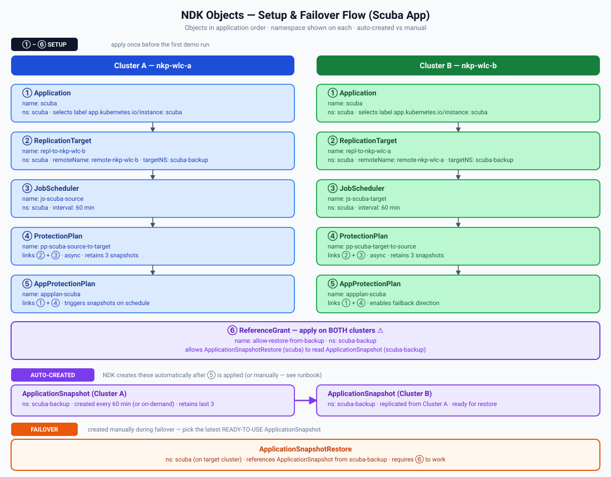

# 🐡 NDK Async Demo Runbook - Scuba Divelog

This runbook demos **Nutanix Data Services for Kubernetes (NDK)** using its **asynchronous replication mode** — NDK also offers near-sync and sync modes, but those aren't covered here. NDK gives application-level backup and disaster recovery for workloads running on Nutanix Kubernetes Platform (NKP). We deploy a small sample app (a scuba dive log — Helm chart, MySQL backed by a PVC, plain Kubernetes Secrets) to one cluster, then use NDK to take point-in-time snapshots and replicate them to a second cluster on an hourly schedule (or on demand). Snapshots capture the app's Kubernetes resources **and** its MySQL PVC data, so restoring on the second cluster (*failover*) — and later back on the first (*failback*) — brings back both the running app and the actual dive log data inside it, including anything added after the last snapshot.

## Get the repo

```bash
git clone -b scuba-no-sealed-secrets https://github.com/miriamcsn/nkp-scuba-divelog.git
cd nkp-scuba-divelog
```

## Namespaces

| Cluster | App runs here | NDK snapshots land here |
| --- | --- | --- |
| A (nkp-wlc-a) | scuba | scuba-backup |
| B (nkp-wlc-b) | scuba | scuba-backup |

## Architecture



## NDK CRDs used in this demo

| Kind | What it does |
| --- | --- |
| `Application` | Selects which cluster resources belong to the protected app, via a label selector (`app.kubernetes.io/instance: scuba`). One per cluster. |
| `ReplicationTarget` | Points at the remote cluster (`Remote`) + namespace where this cluster's snapshots get copied to. |
| `JobScheduler` | The cron-like interval (`js-scuba-source`/`js-scuba-target`, hourly) that triggers automatic snapshots. |
| `ProtectionPlan` | Ties an `Application` + `ReplicationTarget` + `JobScheduler` + retention count together into one protection recipe. |
| `AppProtectionPlan` | Binds a `ProtectionPlan` to an `Application` and reports overall protection health (`AVAILABLE`/`DEGRADED`). |
| `ReferenceGrant` | Cross-namespace permission letting an `ApplicationSnapshotRestore` in `scuba` read `ApplicationSnapshot`s sitting in `scuba-backup`. Required on **both** clusters. |
| `ApplicationSnapshot` | A point-in-time snapshot of the `Application`'s resources (created automatically on schedule, or manually — see below). |
| `ApplicationSnapshotReplication` | Copies one specific snapshot over to the remote cluster's backup namespace. |
| `ApplicationSnapshotRestore` | Recreates the app's resources on a cluster from a given snapshot. Used for failover/failback. |

---

## Initial Setup (one-time)

### 1. Create namespaces on both clusters

```bash
# Cluster A
export KUBECONFIG=~/.kube/manager/nkp-wlc-a-kubeconfig.conf
kubectl create namespace scuba
kubectl create namespace scuba-backup

# Cluster B
export KUBECONFIG=~/.kube/manager/nkp-wlc-b-kubeconfig.conf
kubectl create namespace scuba
kubectl create namespace scuba-backup
```

No Sealed Secrets controller needed — this chart's `mysql-secret.yaml` and
`backend-db-secret.yaml` are plain (unsealed) Secret objects created directly
by `helm install`.

### 2. Deploy the app

```bash
export KUBECONFIG=~/.kube/manager/nkp-wlc-a-kubeconfig.conf
helm install scuba scuba-divelog-no-sealed-secrets --namespace scuba
```

Find the public IP to open the app in your browser (there's no fixed DNS name
in this demo — it's whichever cluster's Traefik LoadBalancer IP is currently
active):

```bash
kubectl get svc -A -o json \
  | jq -r '[.items[] | select(.spec.type=="LoadBalancer" and (.metadata.name | test("traefik")))][0].status.loadBalancer.ingress[0].ip'
```

Open `https://<that-ip>/` in your browser — the app is up but empty.

Now seed demo data:

```bash
./scuba-divelog-no-sealed-secrets/seed-data.sh
```

Refresh the browser — the customer should now see 3 divers, 3 sites, and 6
dives. This is the data we're about to protect with NDK.

### 3. Set up NDK replication

Creates the `Application`, `ReplicationTarget`, `JobScheduler`, `ProtectionPlan`,
`AppProtectionPlan` and `ReferenceGrant` described above. Run this after the
app is deployed on cluster A, since the `Application` resource selects the
running app's resources by label.

First, confirm NDK's own controller is healthy on both clusters — replication
silently does nothing if it isn't:

```bash
export KUBECONFIG=~/.kube/manager/nkp-wlc-a-kubeconfig.conf
kubectl get pods -n ntnx-system -l control-plane=controller-manager

export KUBECONFIG=~/.kube/manager/nkp-wlc-b-kubeconfig.conf
kubectl get pods -n ntnx-system -l control-plane=controller-manager
```

Apply the manifests on cluster A (the source):

```bash
export KUBECONFIG=~/.kube/manager/nkp-wlc-a-kubeconfig.conf
kubectl apply -f ndk/source-ndk.yaml
kubectl apply -f ndk/refgrant.yaml
```

Apply the manifests on cluster B (the target):

```bash
export KUBECONFIG=~/.kube/manager/nkp-wlc-b-kubeconfig.conf
kubectl apply -f ndk/target-ndk.yaml
kubectl apply -f ndk/refgrant.yaml
```

**⚠️ Lesson learned:** `refgrant.yaml` must be applied on **both** clusters.
Without it on the source cluster, failback will fail with "Unauthorised to
access the ApplicationSnapshot".

Verify both sides are healthy before continuing:

```bash
kubectl get remotes.dataservices.nutanix.com -A
kubectl get appprotectionplan -n scuba
```

---

## Trigger an on-demand snapshot

`js-scuba-source`/`js-scuba-target` fire automatically every 60 minutes —
fine in production, too slow for a live demo where you just added data and
want to show it getting backed up right away. This section takes a snapshot
on demand instead of waiting for the next scheduled run.

**⚠️ CAUTION:** NDK can also fire an automatic snapshot immediately after the
`ProtectionPlan`/`AppProtectionPlan` are first applied, not only every 60
minutes. Check whether one already exists before creating a manual one, so
you don't end up demoing two near-identical snapshots:

```bash
kubectl get applicationsnapshots -n scuba
```

If one shows up with a recent `SNAPSHOT-AGE` and `READY-TO-USE: true`, you
can use that one directly and skip the steps below.

Run this against whichever cluster is currently running the app:

```bash
export KUBECONFIG=~/.kube/manager/nkp-wlc-a-kubeconfig.conf   # or nkp-wlc-b
```

**Step 1:** Create the snapshot:

```bash
kubectl apply -f - <<EOF
apiVersion: dataservices.nutanix.com/v1alpha1
kind: ApplicationSnapshot
metadata:
  name: scuba-manual-snap-1
  namespace: scuba
spec:
  source:
    applicationRef:
      name: scuba
  expiresAfter: 24h
EOF
```

**Step 2:** Wait for it to be ready:

```bash
kubectl get applicationsnapshot scuba-manual-snap-1 -n scuba -w
```

**Step 3:** Replicate it to the other cluster (`<REPLICATION-TARGET-NAME>` is
`repl-to-nkp-wlc-b` if the app is running on A, `repl-to-nkp-wlc-a` if on B):

```bash
kubectl apply -f - <<EOF
apiVersion: dataservices.nutanix.com/v1alpha1
kind: ApplicationSnapshotReplication
metadata:
  name: scuba-manual-snap-1-repl
  namespace: scuba
spec:
  applicationSnapshotName: scuba-manual-snap-1
  replicationTargetName: <REPLICATION-TARGET-NAME>
EOF
```

**Step 4:** Watch it complete:

```bash
kubectl get applicationsnapshotreplication scuba-manual-snap-1-repl -n scuba -w
```

**⚠️ Lesson learned:** out-of-band snapshots are **not** automatically
replicated by the ProtectionPlan's schedule — the `ApplicationSnapshotReplication`
step above is required every time. Once it completes, use
`scuba-manual-snap-1` as `<SNAPSHOT-NAME>` in the restore steps below.

---

## Failover (A → B)

Wait for at least 1 snapshot to replicate before proceeding. Check the
`ApplicationSnapshotReplication` on cluster A (the source) — it's ready once
`AVAILABLE` shows `True`:

```bash
kubectl get applicationsnapshotreplications -n scuba
# NAME                                    AVAILABLE   APPLICATIONSNAPSHOT   REPLICATIONTARGET   AGE
# scuba-xxxxxxx-repl-to-nkp-wlc-b          True        scuba-xxxxxxx         repl-to-nkp-wlc-b   2m
```

You can also confirm directly on cluster B (the target) — the snapshot
should show up in `scuba-backup` with `READY-TO-USE: true`:

```bash
export KUBECONFIG=~/.kube/manager/nkp-wlc-b-kubeconfig.conf
kubectl get applicationsnapshots -n scuba-backup
```

Once confirmed, run the failover:

**Step 1:** Clean up cluster A — uninstall the Helm release and delete the PVC:

```bash
export KUBECONFIG=~/.kube/manager/nkp-wlc-a-kubeconfig.conf
helm uninstall scuba -n scuba 2>/dev/null || true
kubectl delete pvc data-scuba-mysql-0 -n scuba 2>/dev/null || true
```

**Step 2:** Clean up cluster B — remove any leftover app resources from a previous failover:

```bash
export KUBECONFIG=~/.kube/manager/nkp-wlc-b-kubeconfig.conf
helm uninstall scuba -n scuba 2>/dev/null || true
kubectl delete pvc data-scuba-mysql-0 -n scuba 2>/dev/null || true
```

**Step 3:** Get the latest snapshot name on cluster B:

```bash
kubectl get applicationsnapshots -n scuba-backup
```

**Step 4:** Apply the restore (replace `<SNAPSHOT-NAME>` with the latest `READY-TO-USE` one):

```bash
kubectl delete applicationsnapshotrestore restore-failover -n scuba 2>/dev/null || true
kubectl apply -f - <<EOF
apiVersion: dataservices.nutanix.com/v1alpha1
kind: ApplicationSnapshotRestore
metadata:
  name: restore-failover
  namespace: scuba
spec:
  applicationSnapshotName: <SNAPSHOT-NAME>
  applicationSnapshotNamespace: scuba-backup
EOF
```

**Step 5:** Watch restore progress:

```bash
kubectl get applicationsnapshotrestore restore-failover -n scuba -w
```

**Step 6:** Force Helm to take ownership of the restored resources:

```bash
helm upgrade --install scuba scuba-divelog-no-sealed-secrets \
  --namespace scuba \
  --force-conflicts
```

**Step 7:** Get cluster B's public IP to verify the app there:

```bash
kubectl get svc -A -o json \
  | jq -r '[.items[] | select(.spec.type=="LoadBalancer" and (.metadata.name | test("traefik")))][0].status.loadBalancer.ingress[0].ip'
```

---

## Failback (B → A)

Before restoring, add a new piece of data on cluster B (the currently active
cluster) and take a fresh on-demand snapshot of it. This shows the customer
that data added *after* the original failover gets backed up too, not just
the initial seed.

Add the new data:

```bash
export KUBECONFIG=~/.kube/manager/nkp-wlc-b-kubeconfig.conf
LB_IP=$(kubectl get svc -A -o json \
  | jq -r '[.items[] | select(.spec.type=="LoadBalancer" and (.metadata.name | test("traefik")))][0].status.loadBalancer.ingress[0].ip')

curl -sk -X POST "https://$LB_IP/api/sites" -H "Content-Type: application/json" -d '{
  "name":"Great Barrier Reef","city":"Cairns","country":"Australia",
  "typical_max_depth_m":20,"typical_visibility":"20m",
  "current_strength":"mild","marine_life":"coral, clownfish, turtles"
}'
```

Refresh the browser to show the new site.

**Step 1:** Create the snapshot (still on cluster B):

```bash
kubectl apply -f - <<EOF
apiVersion: dataservices.nutanix.com/v1alpha1
kind: ApplicationSnapshot
metadata:
  name: scuba-manual-snap-2
  namespace: scuba
spec:
  source:
    applicationRef:
      name: scuba
  expiresAfter: 24h
EOF
```

**Step 2:** Wait for it to be ready:

```bash
kubectl get applicationsnapshot scuba-manual-snap-2 -n scuba -w
```

**Step 3:** Replicate it to cluster A (app is running on B, so the target is `repl-to-nkp-wlc-a`):

```bash
kubectl apply -f - <<EOF
apiVersion: dataservices.nutanix.com/v1alpha1
kind: ApplicationSnapshotReplication
metadata:
  name: scuba-manual-snap-2-repl
  namespace: scuba
spec:
  applicationSnapshotName: scuba-manual-snap-2
  replicationTargetName: repl-to-nkp-wlc-a
EOF
```

**Step 4:** Watch it complete:

```bash
kubectl get applicationsnapshotreplication scuba-manual-snap-2-repl -n scuba -w
```

Use `scuba-manual-snap-2` as `<SNAPSHOT-NAME>` below.

**Step 1:** Clean up cluster A — uninstall the Helm release and delete the PVC:

```bash
export KUBECONFIG=~/.kube/manager/nkp-wlc-a-kubeconfig.conf
helm uninstall scuba -n scuba 2>/dev/null || true
kubectl delete pvc data-scuba-mysql-0 -n scuba 2>/dev/null || true
```

**Step 2:** Get the latest snapshot name on cluster A:

```bash
kubectl get applicationsnapshots -n scuba-backup
```

**Step 3:** Apply the restore (replace `<SNAPSHOT-NAME>` with the latest `READY-TO-USE` one):

```bash
kubectl delete applicationsnapshotrestore restore-failback -n scuba 2>/dev/null || true
kubectl apply -f - <<EOF
apiVersion: dataservices.nutanix.com/v1alpha1
kind: ApplicationSnapshotRestore
metadata:
  name: restore-failback
  namespace: scuba
spec:
  applicationSnapshotName: <SNAPSHOT-NAME>
  applicationSnapshotNamespace: scuba-backup
EOF
```

**Step 4:** Watch restore progress:

```bash
kubectl get applicationsnapshotrestore restore-failback -n scuba -w
```

**Step 5:** Force Helm to take ownership of the restored resources:

```bash
helm upgrade --install scuba scuba-divelog-no-sealed-secrets \
  --namespace scuba \
  --force-conflicts
```

**Step 6:** Clean up cluster B — remove app resources now that the app is back on A:

```bash
export KUBECONFIG=~/.kube/manager/nkp-wlc-b-kubeconfig.conf
helm uninstall scuba -n scuba 2>/dev/null || true
kubectl delete pvc data-scuba-mysql-0 -n scuba 2>/dev/null || true
```

**Step 7:** Get cluster A's public IP to verify the app there:

```bash
export KUBECONFIG=~/.kube/manager/nkp-wlc-a-kubeconfig.conf
kubectl get svc -A -o json \
  | jq -r '[.items[] | select(.spec.type=="LoadBalancer" and (.metadata.name | test("traefik")))][0].status.loadBalancer.ingress[0].ip'
```

---

## Troubleshooting

| Symptom | Cause | Fix |
| --- | --- | --- |
| `ndk-controller-manager` pod stuck `ImagePullBackOff` in `ntnx-system` | NDK's Docker Hub pull secret (`ndk-image-pull-secret`) expired/revoked | Ask the cluster admin to rotate it on both clusters. Replication silently does nothing while this is down — check it first if snapshots aren't appearing. |
| Restore fails: "Unauthorised to access ApplicationSnapshot" | `ReferenceGrant` missing | `kubectl apply -f ndk/refgrant.yaml` on the target cluster |
| Restore fails: "Resources already exist" | Helm release still installed | `helm uninstall scuba -n scuba` before restoring |
| MySQL pod: `CreateContainerConfigError` / "couldn't find key ... in Secret" right after a restore | NDK restores Secret objects with empty data | Expected — run `helm upgrade --install --force-conflicts`, which re-applies this chart's hardcoded secret values on top |
| Manual `ApplicationSnapshot` never shows up on the other cluster | Out-of-band snapshots aren't auto-replicated | Create the replication yourself: `kubectl apply -f - <<< '{"apiVersion":"dataservices.nutanix.com/v1alpha1","kind":"ApplicationSnapshotReplication","metadata":{"name":"<snapshot-name>-repl","namespace":"scuba"},"spec":{"applicationSnapshotName":"<snapshot-name>","replicationTargetName":"repl-to-nkp-wlc-a-or-b"}}'` |
| Can't reach the app after failover | Using the old cluster's Traefik IP | Re-run `kubectl get svc -A \| grep -i traefik` on the *new* active cluster |
| 503 / connection refused right after restore | App pods not ready yet | Wait for `kubectl rollout status deployment/scuba-frontend -n scuba` to complete |
| "No available server" | Two wildcard ingresses conflicting | Annotate the stale ingress: `kubectl annotate ingress scuba -n <old-namespace> traefik.ingress.kubernetes.io/router.entrypoints=none` |
